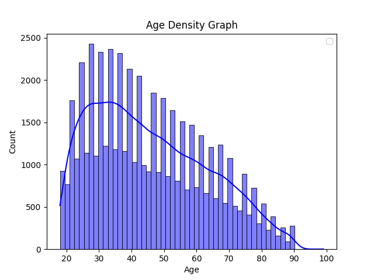

Describe:
                age          year
count  53285.000000  53474.000000
mean      45.631285   1991.954894
std       17.472393     10.948351
min       18.000000   1973.000000
25%       31.000000   1983.000000
50%       43.000000   1993.000000
75%       59.000000   2002.000000
max       99.000000   2010.000000

